# ANSIBLE DYNAMIC ASSIGNMENTS (INCLUDE) AND COMMUNITY ROLES

In this project we will introduce dynamic assignments by using include module. The difference between static and dynamic assignment is that static assignments uses import module while dynamic assignment uses include module.

Well, from Project 12, you can already tell that . The module that enables dynamic assignments is include.

When the import module is used, all statements are pre-processed at the time playbooks are parsed. Meaning, when you execute site.yml playbook, Ansible will process all the playbooks referenced during the time it is parsing the statements. This also means that, during actual execution, if any statement changes, such statements will not be considered. Hence, it is static.

On the other hand, when include module is used, all statements are processed only during execution of the playbook. Meaning, after the statements are parsed, any changes to the statements encountered during execution will be used.

in most cases it is recommended to use static assignments for playbooks, because it is more reliable. With dynamic assignments, it is hard to debug playbook problems due to its dynamic nature. However, you can use dynamic assignments for environment specific variables as we will be introducing in this project.

### INTRODUCING DYNAMIC ASSIGNMENT INTO OUR STRUCTURE

We will make a copy of the Github `ansible-config-mgt` in the main branch and create a new branch dynamic-assignments.
```
git status
```
```
git pull
```
```
git checkout -b dynamic-assignment
```

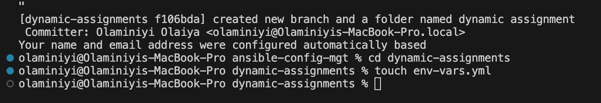

Create a new folder, name it dynamic-assignments. Then inside this folder, create a new file and name it env-vars.yml

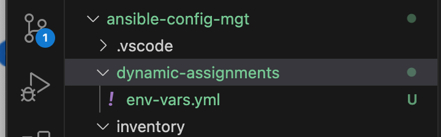

create a new folder env-vars, then for each environment, create new YAML files which we will use to set variables

updated env-vars.yaml with the code below
```
---
- name: collate variables from env specific file, if it exists
  hosts: all
  tasks:
    - name: looping through list of available files
      include_vars: "{{ item }}"
      with_first_found:
        - files:
            - dev.yml
            - stage.yml
            - prod.yml
            - uat.yml
          paths:
            - "{{ playbook_dir }}/../env-vars"
      tags:
        - always
```

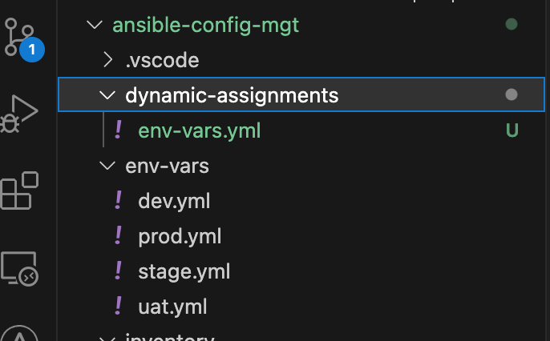

> [!NOTE] 
> We used include_vars module instead of include. This is because Ansible developers decided to separate different features of the module. From Ansible version 2.8, the include module is deprecated and variants of include*_ must be used. These are:

- include_role.
- include_tasks.
- include_vars.
In the same version, variants of import were also introduced such as:

- import_role
- import_tasks

We made use of a special variables { playbook_dir } and { inventory_file }. { playbook_dir } will help Ansible to determine the location of the running playbook, and from there navigate to other path on the filesystem. { inventory_file } on the other hand will dynamically resolve to the name of the inventory file being used, then append .yml so that it picks up the required file within the env-vars folder. We are including the variables using a loop.0__with_first_found__ implies that, looping through the list of files, the first one found is used. This is good so that we can always set default values in case an environment specific env file does not exist.

### Update site.yml

Update site.yml file to make use of the dynamic assignment.

```
---
- hosts: all
- name: Include dynamic variables 
  tasks:
  import_playbook: ../static-assignments/common.yml 
  include: ../dynamic-assignments/env-vars.yml
  tags:
    - always

-  hosts: webservers
- name: Webserver assignment
  import_playbook: ../static-assignments/webservers.yml
```

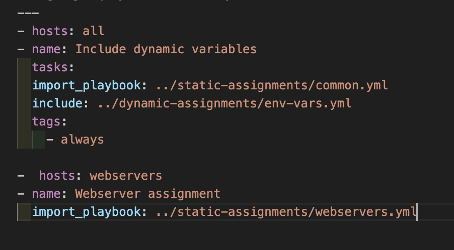

### DOWNLOAD MYSQL ANSIBLE ROLE

to create a role for **MySQL database** – it should install the MySQL package, create a database and configure users. There are tons of roles that have already been developed by other open source engineers out there. These roles are actually production ready and dynamic to accomodate most of Linux flavours. We can simply download a ready to use ansible role.

You can browse available community roles [here](https://galaxy.ansible.com/ui/)

Inside roles directory create your new [MySQL role](https://galaxy.ansible.com/ui/standalone/roles/geerlingguy/mysql/) with ansible-galaxy install geerlingguy.mysql and rename the folder to mysql

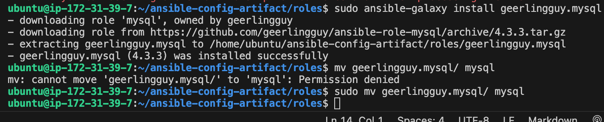

Edit roles configuration to use correct credentials for MySQL required for the tooling website.

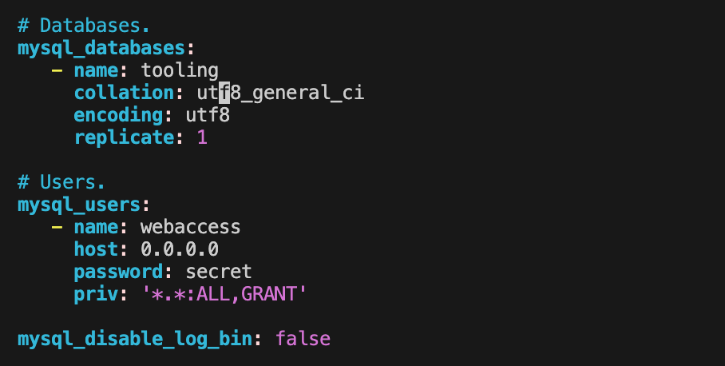

Now it is time to upload the changes into your GitHub

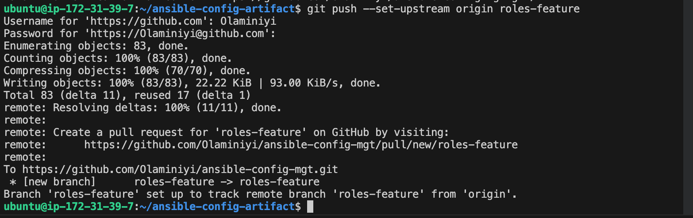

### Load Balancer roles

We want to be able to choose which Load Balancer to use, Nginx or Apache, so we need to have two roles respectively:
- Nginx
- Apache

We will create _roles for Nginx and Apache from the community roles.

Copy the link for the role


Install nginx and apache from geerlingguy using using ansible-galaxy
From the Jenkin-ansible server, cd into roles
```
cd roles
```
```
ansible-galaxy install geerlingguy.nginx
```
Rename the folder to nginx
``` 
mv geerlingguy.nginx/ nginx
```
```
ansible-galaxy install geerlingguy.apache
```
Rename the folder to apache
``` 
mv geerlingguy.apache/ apache
```


### configure both the apache and nginx roles
For nginx, cd into nginx
```
cd nginx
```
```
sudo vi \defaults/main.yml/
```
Edit ##nginx-upstreams
Check uat.yml and put 2 web UAT servers IP addresses

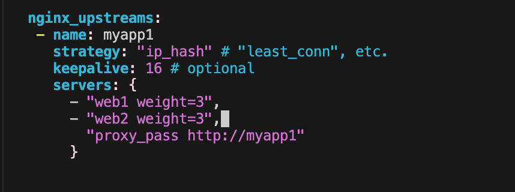
        
Edit nginx_extra_http_option
Uncomment the ngnix_extra_http_option section

cd into task, edit main.yml
```
cd task
```
set up the ip address to web1 and web2 under the #vhost configuration


under #nginx setup
add become: true under the name
         
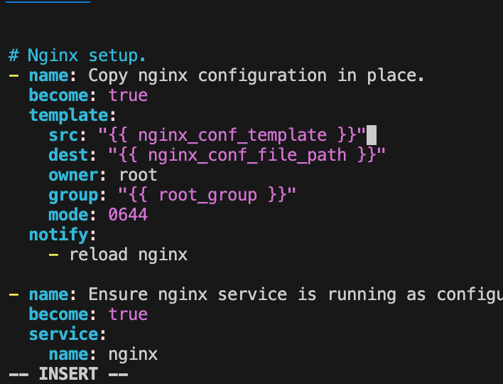  

under setup/install tasks
delete " or ansible _os_family == 'Rocky'  "

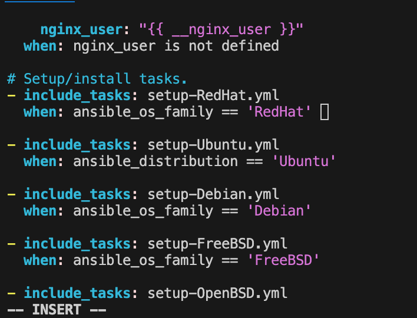
        
cd into template and edit nginx.conf.j2
```
sudo vi nginx.conf.j2
```
  
Edit sudo vi \roles/nginx/tasks/setup-RedHat.yml
```
sudo vi \roles/nginx/tasks/setup-RedHat.yml
```
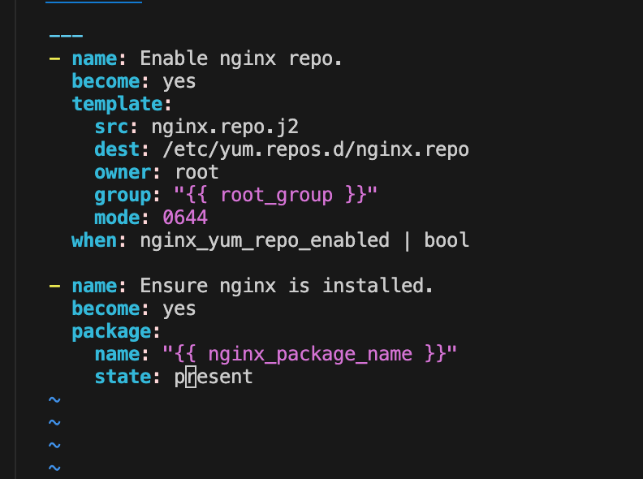

Edit sudo vi \inventory/uat.yml
```
sudo vi \inventory/uat.yml
```

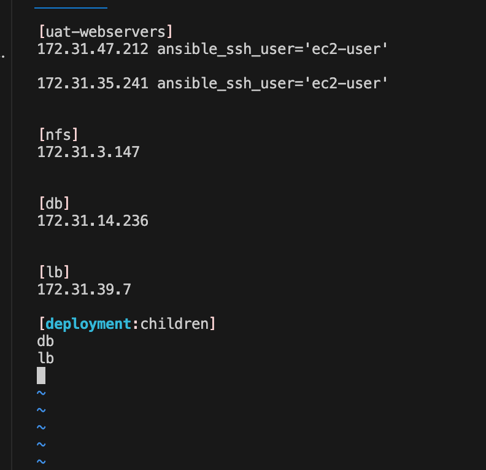

Since you cannot use both `Nginx` and `Apache load balancer`, you need to add a condition to enable either one – this is where you can make use of variables.

 Declare a variable in `defaults/main.yml` file inside the `Nginx` and `Apache roles`. Name each variables `enable_nginx_lb` and `enable_apache_lb` respectively.

 Set both values to false like this `enable_nginx_lb: false` and `enable_apache_lb: false`

 - Declare another variable in both `roles` `load_balancer_is_required` and set its value to `false` as well

 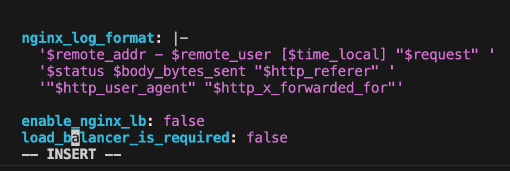

 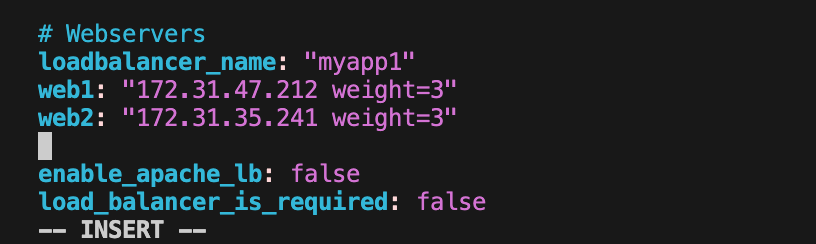

Update both assignment and site.yml files respectively
created a new file named `loadbalancers.yml` in static assignment folder
Update it with
 
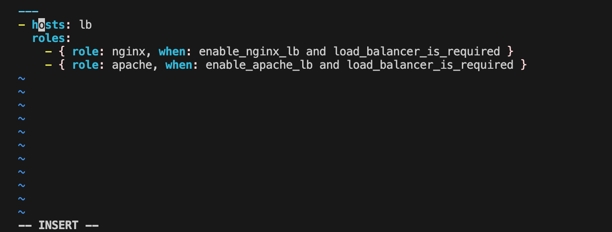

Create another file named database.yml
Update it with 

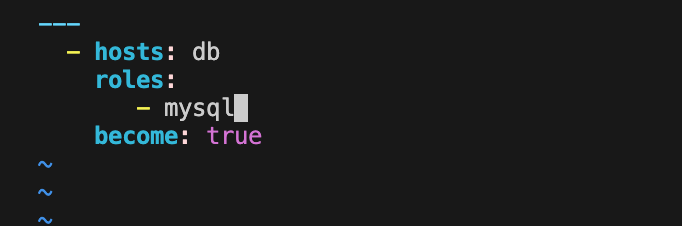

Update site.yml

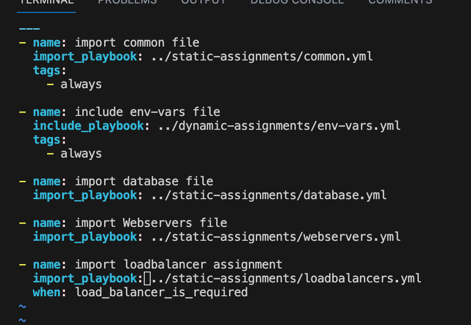

Now you can make use of `env-vars\uat.yml` file to define which loadbalancer to use in UAT environment by setting respective environmental variable to true.
You will activate load balancer, and enable `nginx `by setting these in the respective environment’s `env-vars` file.
cd into env-vars and update the uat.yml with this:
```
cd env-vars
```
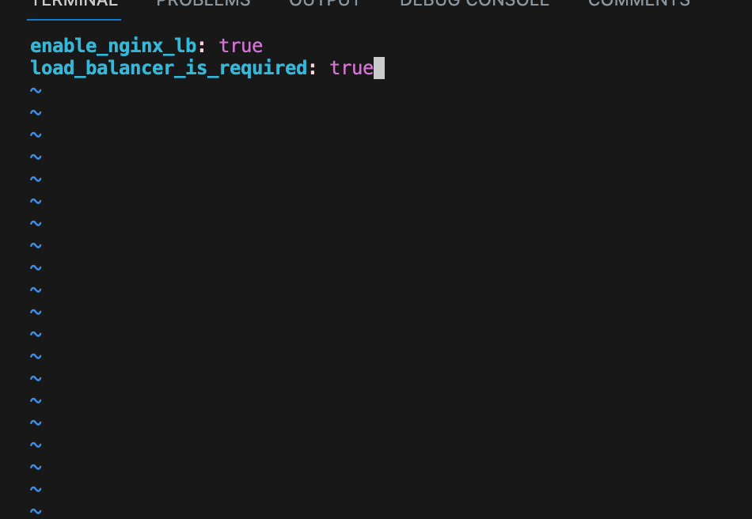

### Running the ansible playbook
```
ansible-playbook -i inventory/uat.yml playbooks/site.yml
```
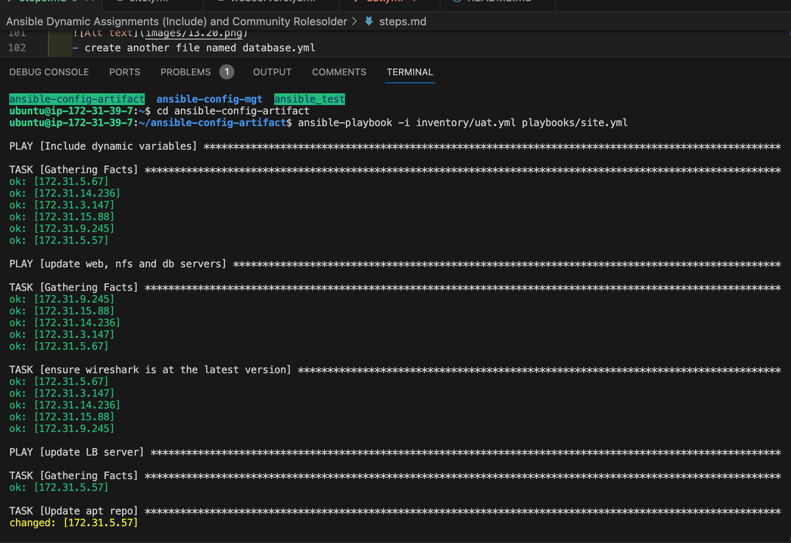

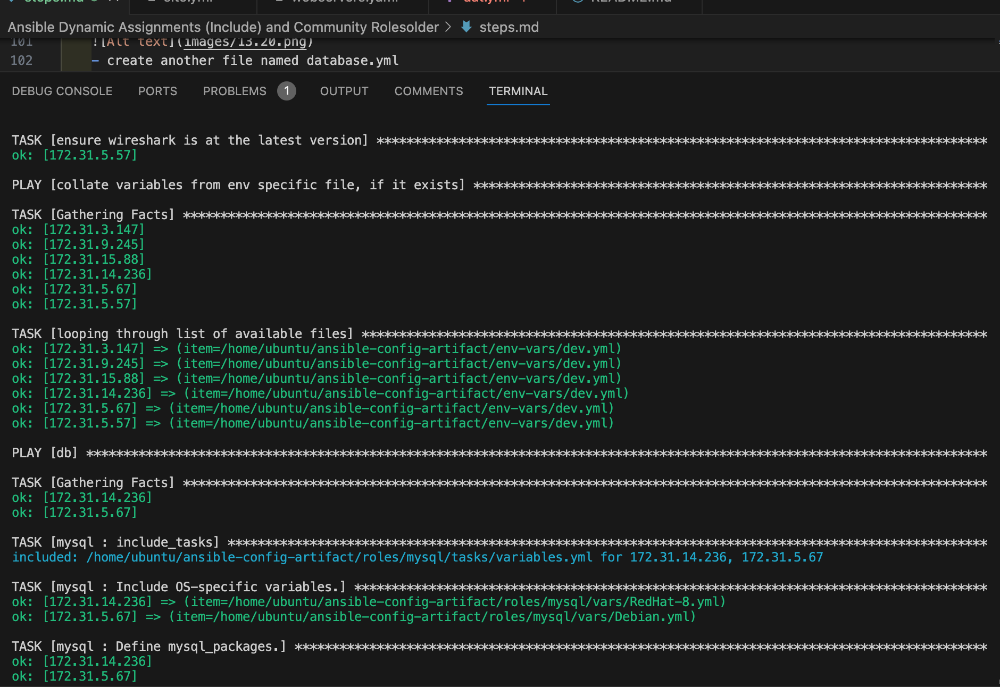

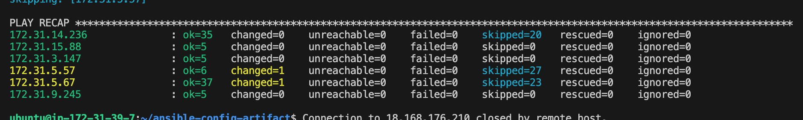

From the browser

