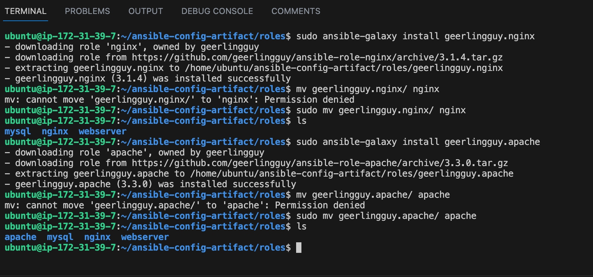
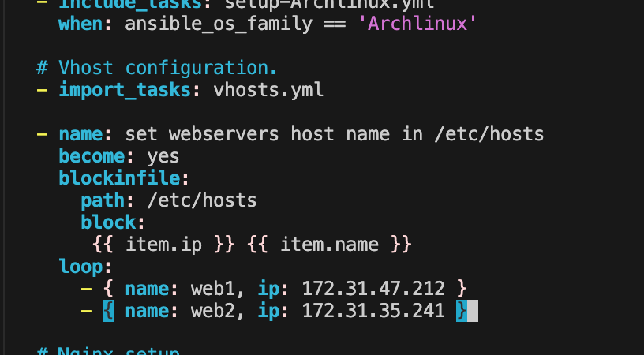

# ANSIBLE DYNAMIC ASSIGNMENTS (INCLUDE) AND COMMUNITY ROLES

In this project we will introduce dynamic assignments by using include module. The difference between static and dynamic assignment is that static assignments uses import module while dynamic assignment uses include module.

Well, from Project 12, you can already tell that . The module that enables dynamic assignments is include.

When the import module is used, all statements are pre-processed at the time playbooks are parsed. Meaning, when you execute site.yml playbook, Ansible will process all the playbooks referenced during the time it is parsing the statements. This also means that, during actual execution, if any statement changes, such statements will not be considered. Hence, it is static.

On the other hand, when include module is used, all statements are processed only during execution of the playbook. Meaning, after the statements are parsed, any changes to the statements encountered during execution will be used.

in most cases it is recommended to use static assignments for playbooks, because it is more reliable. With dynamic assignments, it is hard to debug playbook problems due to its dynamic nature. However, you can use dynamic assignments for environment specific variables as we will be introducing in this project.

### INTRODUCING DYNAMIC ASSIGNMENT INTO OUR STRUCTURE

We will make a copy of the Github `ansible-config-mgt` in the main branch and create a new branch dynamic-assignments.
```
git status
```
```
git pull
```
```
git checkout -b dynamic-assignment
```


Create a new folder, name it dynamic-assignments. Then inside this folder, create a new file and name it env-vars.yml


create a new folder env-vars, then for each environment, create new YAML files which we will use to set variables


Update site.yml file to make use of the dynamic assignment.


Inside roles directory create your new MySQL role with ansible-galaxy install geerlingguy.mysql and rename the folder to mysql


Read README.md file, and edit roles configuration to use correct credentials for MySQL required for the tooling website.


Now it is time to upload the changes into your GitHub


### Load Balancer roles
    - We want to be able to choose which Load Balancer to use, Nginx or Apache, so we need to have two roles respectively:
    - install nginx and apache from geerlingguy using using ansible-galaxy
    - from the Jenkin-ansible server, cd into roles
    - ansible-galaxy install geerlingguy.nginx
    - rename the folder to nginx
        - mv geerlingguy.nginx/ nginx
    - ansible-galaxy install geerlingguy.apache
    - rename the folder to apache
        -mv geerlingguy.apache/ apache
    

9. configure both the apache and nginx roles with the README document
    - for nginx, cd into nginx
    - sudo vi \defaults/main.yml/
        - edit ##nginx-upstreams
        - check uat.yml and put 2 web UAT servers IP addresses
            
        
        - edit nginx_extra_http_option
        - uncomment the ngnix_extra_http_option section


        - cd into task, edit main.yml
        - set up the ip address to web1 and web2 under the #vhost configuration
        
        - under #nginx setup
        - add become: true under the name
            

        - under setup/install tasks
            - delete " or ansible _os_family == 'Rocky'  "
            
        
        - cd into template and edit nginx.conf.j2
        -   sudo vi nginx.conf.j2
        - nothing for now

    - configure apache *************************************************
    - cd into apache and config the main.yml of the defaults folder
        - add this to the end of the file
              loadbalancer_name: "myapp1"
              web1: "172.31.47.212 "
              web2: "172.31.35.241"
        
        -  under apache_vhosts:
        - add
            - loadbalancer_name: "myapp1"

        - edit the main.yml of the tasks folder

        
        - edit the setup-RedHat.yml under the task folder
            - make beome: yes on the next line under name
            - add this to the end of file
            - name: set httpd_can_network_connect flag on and keep it persistent across reboots
                become: yes
                ansible.posix.seboolean:
                name: httpd_can_network_connect
                state: yes
                persistent: yes
        
        ***************************************************************************
- edit sudo vi \roles/nginx/tasks/setup-RedHat.yml


- edit sudo vi \inventory/uat.yml


9. Since you cannot use both Nginx and Apache load balancer, you need to add a condition to enable either one – this is where you can make use of variables.
 - Declare a variable in defaults/main.yml file inside the Nginx and Apache roles. Name each variables enable_nginx_lb and enable_apache_lb respectively.
 - Set both values to false like this enable_nginx_lb: false and enable_apache_lb: false
 - Declare another variable in both roles load_balancer_is_required and set its value to false as well
 
 

 - Update both assignment and site.yml files respectively
    - created a new file named loadbalancers.yml in static assignment folder
    - update it with
    
    - create another file named database.yml
    - update it with 
    

    - update site.yml
    

Now you can make use of env-vars\uat.yml file to define which loadbalancer to use in UAT environment by setting respective environmental variable to true.
You will activate load balancer, and enable nginx by setting these in the respective environment’s env-vars file.
- cd into env-vars and update the uat.yml with this:


- Running the ansible playbook
 - ansible-playbook -i inventory/uat.yml playbooks/site.yml


